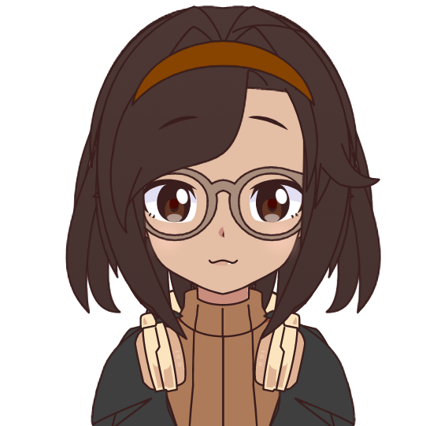

# Journal de Maloney Khim

* [Semaine 1](#semaine-1)
* [Semaine 2](#semaine-2)
* [Semaine 3](#semaine-3)
* [Semaine 4](#semaine-4)
* [Semaine 5](#semaine-5)
* [Semaine de rattrapage](#semaine-de-rattrapage)
* [Semaine 6](#semaine-6)
* [Semaine 7](#semaine-7)
* [Semaine 8](#semaine-8)
* [Semaine 9](#semaine-9)

## Semaine 1

### Résumé des réalisations effectuées
- J'ai commencé à dessiner mon tableau.

### Image d'une réalisation dont tu es la ou le plus fier

### Est-ce que j'ai accompli l'ensemble des tâches et objectifs que je m'étais fixés pour cette semaine?	
- [ ] Complètement
- [X] Assez
- [ ] Peu
- [ ] Pas du tout

#### Décrivez pourquoi.
L'animation de nos tableaux va probablement prendre beaucoup de temps, donc c'est une bonne chose de l'avoir commencé!

### Mon projet s'est-il réalisé selon l’échéancier prévu?

- [X] Complètement
- [ ] Assez
- [ ] Un peu
- [ ] Pas tout à fait

### Défis pour la prochaine semaine
Terminer le dessin du tableau de base (sans les animations).

---
## Semaine 2
### Résumé des réalisations effectuées
- J'ai continué le dessin de mon tableau
- J'ai recherché des tutoriels sur After Effect
- J'ai commencé des tests d'animation

### Image d'une réalisation dont tu es la ou le plus fier

### Est-ce que j'ai accompli l'ensemble des tâches et objectifs que je m'étais fixés pour cette semaine?

- [X] Complètement
- [ ] Assez
- [ ] Peu
- [ ] Pas du tout

#### Décrivez pourquoi.
En plus d'avoir terminé le dessin de mon tableau, j'ai eu l'opportunité de tester quelques effets d'animations et d'ajuster quelques détails au besoin.

### Mon projet s'est-il réalisé selon l’échéancier prévu?

- [X] Complètement
- [ ] Assez
- [ ] Un peu
- [ ] Pas tout à fait

### Défis pour la prochaine semaine
- Travailler sur l'animation des yeux, des cheveux et de la jupe.
- Paufiner l'animation de la pluie et de la flaque d'eau

---
## Semaine 3 
### Résumé des réalisations effectuées
- J'ai travaillé sur les animations des yeux, des cheveux et de la jupe
- J'ai paufiné l'animation de la pluie et de la flaque d'eau
- J'ai acheté le fil à pêche pour accrocher les tableaux
- J'ai travaillé sur le powerpoint de la préproduction
- J'ai ajouté des effets de pluie au tableau d'Olivier

### Image d'une réalisation dont tu es la ou le plus fier

### Est-ce que j'ai accompli l'ensemble des tâches et objectifs que je m'étais fixés pour cette semaine?

- [X] Complètement
- [ ] Assez
- [ ] Peu
- [ ] Pas du tout

#### Décrivez pourquoi.
Je suis contente d'avoir pu terminer l'animation de la fille, de la pluie et de la flaque. Il ne me reste plus que quelques animations de gouttes et ensuite je vais probablement aider à produire les petits tableaux.

### Mon projet s'est-il réalisé selon l’échéancier prévu?

- [ ] Complètement
- [X] Assez
- [ ] Un peu
- [ ] Pas tout à fait

### Défis pour la prochaine semaine
- Animer les gouttes qui glissent sur le parapluie
- Animer les gouttes qui tombent de la main qui essaie d'attraper l'eau
- Améliorer/retravailler le patch max de mon effet de buée avec l'aide des profs

---
## Semaine 4
### Résumé des réalisations effectuées

- J'ai animé les gouttes qui tombent de la main qui essaie d'attraper la pluie
- J'ai fait un effet de gouttes de pluie qui glissent sur de la buée dans After Effects
- J'ai assisté à un mini-cours sur Max de Daryl
- J'ai retravaillé sur mon patch max de mon effet de buée avec l'aide de Daryl

### Image d'une réalisation dont tu es la ou le plus fier

### Est-ce que j'ai accompli l'ensemble des tâches et objectifs que je m'étais fixés pour cette semaine?

- [ ] Complètement
- [X] Assez
- [ ] Peu
- [ ] Pas du tout

#### Décrivez pourquoi.
 
- Je n'ai pas pu faire les gouttes qui rebondissent sur le parapluie, à la place, j'ai réalisé manuellement l'effet de pluie qui glisse sur la buée puisqu'il n'existe pas de vidéo avec écran vert assez grand pour mon tableau. Sinon, j'ai tout de même pu travailler sur les gouttes de la main et le patch max.

#### S'il y a lieu, qu'allez-vous faire pour remédier à la situation?

- Je vais travailler sur la pluie qui rebondit sur le parapluie la semaine prochaine.

### Mon projet s'est-il réalisé selon l’échéancier prévu?

- [X] Complètement
- [ ] Assez
- [ ] Un peu
- [ ] Pas tout à fait

### Défis pour la prochaine semaine

- Travailler sur Jit.Grab pour tester la caméra dans mon patch Max
- Faire l'effet de la pluie qui rebondit sur le parapluie
- (Peut-être) Aider avec les petits tableaux

---
## Semaine 5
### Résumé des réalisations effectuées

- J'ai réalisé l'effet de la pluie qui rebondit sur le parapluie
- J'ai réalisé un petit tableau avec des étoiles qui bougent dans After Effects
- Je suis allée au DeSerres avec mes coéquipiers pour acheter des faux cadres

### Image d'une réalisation dont tu es la ou le plus fier

### Est-ce que j'ai accompli l'ensemble des tâches et objectifs que je m'étais fixés pour cette semaine?

- [ ] Complètement
- [X] Assez
- [ ] Peu
- [ ] Pas du tout

#### Décrivez pourquoi.

Je suis contente d'avoir pu terminé l'animation principale de mon tableau. Toutefois, parce que nous sommes encore en train de préparer l'accrochage des cadres, je n'ai pas pu faire un test de la caméra (Jit.Grab) pour mon tableau.

#### S'il y a lieu, qu'allez-vous faire pour remédier à la situation?

Faire un test de Jit.Grab la semaine prochaine. J'irais emprunter une webcam pour le tester qu'on soit prêt à tester sur mon cadre final ou non.

### Mon projet s'est-il réalisé selon l’échéancier prévu?

- [X] Complètement
- [ ] Assez
- [ ] Un peu
- [ ] Pas tout à fait

### Défis pour la prochaine semaine

- Faire un effet de caméra pédestal pour mon tableau (puisque mon cadre est mon haut que mon dessin)
- Aider à monter les faux cadres
- Faire un test de Jit.Grab et si possible un test live de mon tableau
- Aider à faire un autre petit tableau (papillon doré peut-être??)

---
## Semaine de rattrapage
### Résumé des réalisations effectuées

- J'ai aidé à monter les faux cadres
- J'ai fait le petit tableau du papillon doré
- J'ai fait le petit tableau du papillon avec les nuages
- J'ai ajouté les effets de pluie au petit tableau de fleurs
- Je suis allée au DeSerres avec Émilie pour faire un échange de transverses
- J'ai fait un effet de caméra pédestal pour mon tableau

### Image d'une réalisation dont tu es la ou le plus fier

### Est-ce que j'ai accompli l'ensemble des tâches et objectifs que je m'étais fixés pour cette semaine?

- [ ] Complètement
- [X] Assez
- [ ] Peu
- [ ] Pas du tout

#### Décrivez pourquoi.
 
Au final, ce fut Sounthida et Olivier qui se sont occupés de tester l'effet de mon tableau avec le Jit.Grab et le téléphone. Toutefois, j'ai pu réaliser toutes mes autres tâches et j'ai fait deux petits tableaux plutôt qu'un seul.

### Mon projet s'est-il réalisé selon l’échéancier prévu?

- [X] Complètement
- [ ] Assez
- [ ] Un peu
- [ ] Pas tout à fait

### Défis pour la prochaine semaine

- Aider à accrocher les cadres
- Réaliser le troisième petit tableau de papillon (sous la pluie cette fois)
- Tester les interactions + kinect une fois tous les tableaux finis/accrochés

---
## Semaine 6
### Résumé des réalisations effectuées

- J'ai réalisé le petit tableau du papillon dans la pluie
- J'ai réalisé la version finale du petit tableau des étoiles
- J'ai aidé à accroché les lumières
- J'ai aidé à découper les éponges qui serviront à stabiliser les cadres

### Image d'une réalisation dont tu es la ou le plus fier

### Est-ce que j'ai accompli l'ensemble des tâches et objectifs que je m'étais fixés pour cette semaine?

- [ ] Complètement
- [X] Assez
- [ ] Peu
- [ ] Pas du tout

#### Décrivez pourquoi.
 
Je n'ai pas accroché les cadres cette semaines, à la place, j'ai aidé à accrocher les lumières.

### Mon projet s'est-il réalisé selon l’échéancier prévu?

- [X] Complètement
- [ ] Assez
- [ ] Un peu
- [ ] Pas tout à fait

### Défis pour la prochaine semaine

- Mettre les éponges derrière les tableaux pour les stabiliser
- Aider pour la création du scénario de la vidéo
- Aider à faire le mapping des tableaux et tester les interactions
- Aider à déplacer les ordinateurs et les tables
- Mettre les poteaux de la file d'attente (lorsqu'ils seront disponibles)

---
## Semaine 7
### Résumé des réalisations effectuées

- J'ai aidé pour la création du scénario de la vidéo
- J'ai aidé à faire le mapping des tableaux
- J'ai aidé à tester les interactions
- J'ai modifié mes petits tableaux (couleur, 30 fps et effet papier)
- J'ai réalisé ma signature pour mon tableau principal
- J'ai mis un fond étoilé à notre compostion de madmapper
- J'ai modifié la bannière pour le site web

### Image d'une réalisation dont tu es la ou le plus fier

### Est-ce que j'ai accompli l'ensemble des tâches et objectifs que je m'étais fixés pour cette semaine?

- [X] Complètement
- [ ] Assez
- [ ] Peu
- [ ] Pas du tout

#### Décrivez pourquoi.

On a fixé beaucoup d'affaires cette semaine, comme le mapping des vidéos, les interactions, et les petits tableaux.

### Mon projet s'est-il réalisé selon l’échéancier prévu?

- [ ] Complètement
- [X] Assez
- [ ] Un peu
- [ ] Pas tout à fait

#### Décrivez pourquoi.
 
Les poteaux d'attentes ne sont toujours pas disponibles!!!

