# Journal de Sounthida Kong

* [Semaine 1](#semaine-1)
* [Semaine 2](#semaine-2)
* [Semaine 3](#semaine-3)
* [Semaine 4](#semaine-4)
* [Semaine 5](#semaine-5)
* [Semaine de rattrapage](#semaine-de-rattrapage)
* [Semaine 6](#semaine-6)
* [Semaine 7](#semaine-7)
* [Semaine 8](#semaine-8)
* [Semaine 9](#semaine-9)

## Semaine 1

### Résumé des réalisations effectuées
- Avec l'aide de Guillaume, j'ai réussit à faire communiquer des données de Pure Data à Max, afin que lorsque la Kinect envoie un 1 (une présence) à PureData, Max le reçoit aussi.
- J'ai commencé le croquis sur papier de l'illustration de mon cadre
- J'ai modifié le synopsis, les matériaux requis ainsi que les rôles dans notre documentation gitHub
- Nous avons réalisé la vidéo conférence pour la documentation de la préproduction.

### Image d'une réalisation dont tu es la ou le plus fier
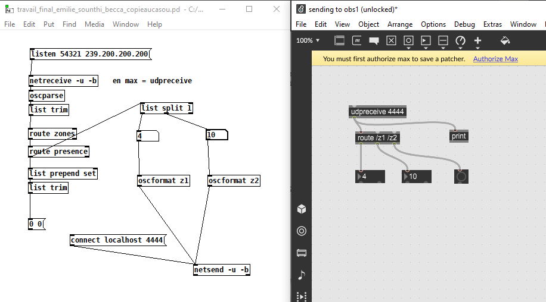
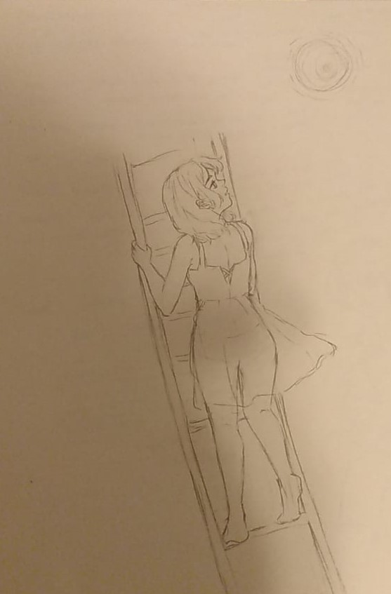

### Est-ce que j'ai accompli l'ensemble des tâches et objectifs que je m'étais fixés pour cette semaine?
- [ ] Complètement
- [x] Assez
- [ ] Peu
- [ ] Pas du tout

#### Décrivez pourquoi.
Parce que le fait que j'ai réussit de communiquer à Max de Pure Data lorsque les zones de Kinect détectent une présence ça me débloque beaucoup, maintenant je peux faire ce que je veux avec ces données de présence ou absence sur une zone!

### Défis pour la prochaine semaine
- Aller à l'école pour tester mon patch Max avec la Kinect
- Enregistrer douche pluie + son eau qui coule comme vague

---
## Semaine 2

### Résumé des réalisations effectuées
- Enregistrer le bruit de pluie avec un parapluie dans ma douche pluie et l'effet sonore de cascade
- Numériser mon croquis
- Finir l'arrière-plan de mon tableau
- Commencer l'animation de mon personnage, animation de base faite (animation du corps + animation des cheveux)

### Image d'une réalisation dont tu es la ou le plus fier
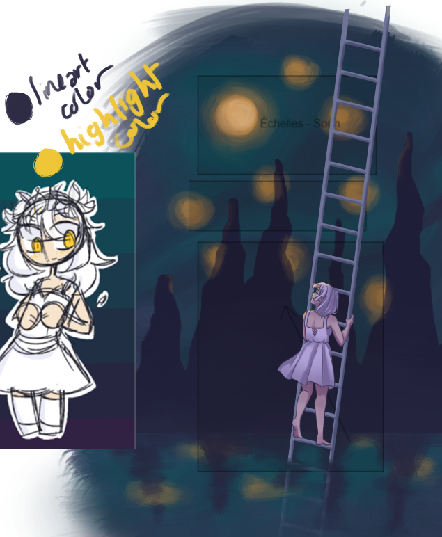

### Est-ce que j'ai accompli l'ensemble des tâches et objectifs que je m'étais fixés pour cette semaine?

- [ ] Complètement
- [x] Assez
- [ ] Peu
- [ ] Pas du tout

#### Décrivez pourquoi.
Je trouve que je me suis bien avancé dans mon animation, et que la production de mon animation va un peu plus vite que prévue. La seule chose que je n'ai pas faite était d'aller tester mon patch Max avec la Kinect au grand studio.

#### S'il y a lieu, qu'allez-vous faire pour remédier à la situation?

### Mon projet s'est-il réalisé selon l’échéancier prévu?

- [ ] Complètement
- [x] Assez
- [ ] Un peu
- [ ] Pas tout à fait

#### S'il y a des écarts, décrivez-les.

#### S'il y a lieu, qu'allez-vous faire pour remédier à la situation?

### Défis pour la prochaine semaine

- Faire l'animation de la robe
- Finir le coloriage de mon animation

---

## Semaine 3 
### Résumé des réalisations effectuées
- J'ai fini complètement les lignes de mon animation, il ne reste que la colorisation
- J'ai désinstallé un projecteur afin que nous puissons l'utiliser pour notre projet
- Préciser le scénarimage du document GitHub et section défis techniques
- Enregistrer la vidéoconférence de notre préproduction GitHub

### Image d'une réalisation dont tu es la ou le plus fier

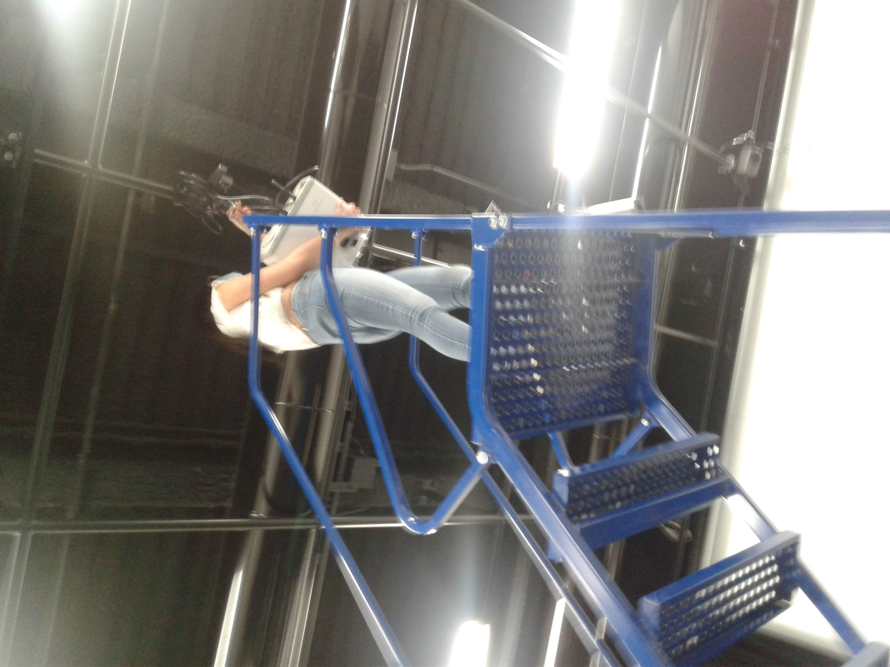

### Est-ce que j'ai accompli l'ensemble des tâches et objectifs que je m'étais fixés pour cette semaine?

- [ ] Complètement
- [x] Assez
- [ ] Peu
- [ ] Pas du tout

#### Décrivez pourquoi.
Je suis contente d'avoir fini mon animation mais j'ai peut-être un peu procrastiné ce qui a fait que je n'ai pas encore fini le coloriage de mon animation comme je l'aurais voulu.
 

#### S'il y a lieu, qu'allez-vous faire pour remédier à la situation?

### Mon projet s'est-il réalisé selon l’échéancier prévu?

- [ ] Complètement
- [x] Assez
- [ ] Un peu
- [ ] Pas tout à fait

#### S'il y a des écarts, décrivez-les.

#### S'il y a lieu, qu'allez-vous faire pour remédier à la situation?

### Défis pour la prochaine semaine
- Finir la coloration de mon animation
- Installer le projecteur
- Mesurer la projection des cadres

---

## Semaine 4
### Résumé des réalisations effectuées
- J'ai bientôt fini le coloriage de mon animation de mon personnage.
- J'ai enlevé les fils dont on n'avais pas besoin pour *clearer* le plafond.
- J'ai installé le projecteur.
- J'ai fait la connection de notre projecteur à notre ordinateur avec le HDMI Transmitter et Receiver.

### Image d'une réalisation dont tu es la ou le plus fier
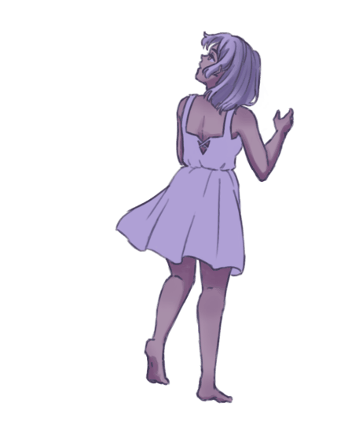

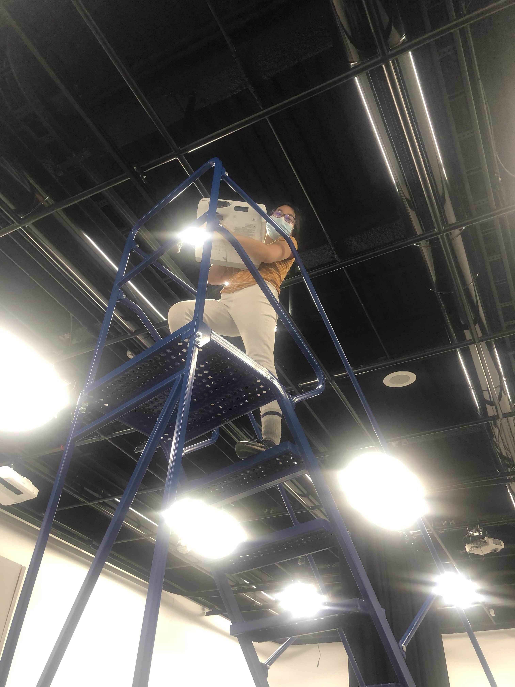

### Est-ce que j'ai accompli l'ensemble des tâches et objectifs que je m'étais fixés pour cette semaine?

- [x] Complètement
- [ ] Assez
- [ ] Peu
- [ ] Pas du tout

#### Décrivez pourquoi.
Nous nous sommes énormément avancer dans les installations, donc on va pouvoir faire des tests physiques dès la semaine prochaine! Il ne nous reste que les hauts-parleurs à installer et les lumières, mais le principale est là: la projection marche!
 

#### S'il y a lieu, qu'allez-vous faire pour remédier à la situation?

### Mon projet s'est-il réalisé selon l’échéancier prévu?

- [x] Complètement
- [ ] Assez
- [ ] Un peu
- [ ] Pas tout à fait

#### S'il y a des écarts, décrivez-les.

#### S'il y a lieu, qu'allez-vous faire pour remédier à la situation?

### Défis pour la prochaine semaine
- Finir mon animation au complet, avec le background animé aussi
- Avec mon patch Max, faire l'analyse des données de la Kinect afin de les envoyer à mes collègues
- Déterminer comment on peut envoyer une vidéo Max à MadMapper

---

## Semaine 5

### Résumé des réalisations effectuées
- J'ai complètement fini mon animation
- J'ai aidé à mesurer la hauteur de la projection des cadres du plan initial
- J'ai remanipuler le projecteur afin que la projection soit plus petite et plus claire
- J'ai fait un prototype de l'analyse des données de présence de la Kinect sur Max avec seulement deux zones placés au hasard
- J'ai ramené mes coéquipiers et les faux-cadres en voiture au studio

### Image d'une réalisation dont tu es la ou le plus fier
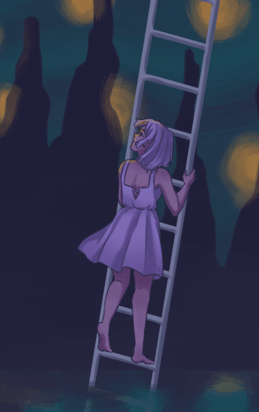
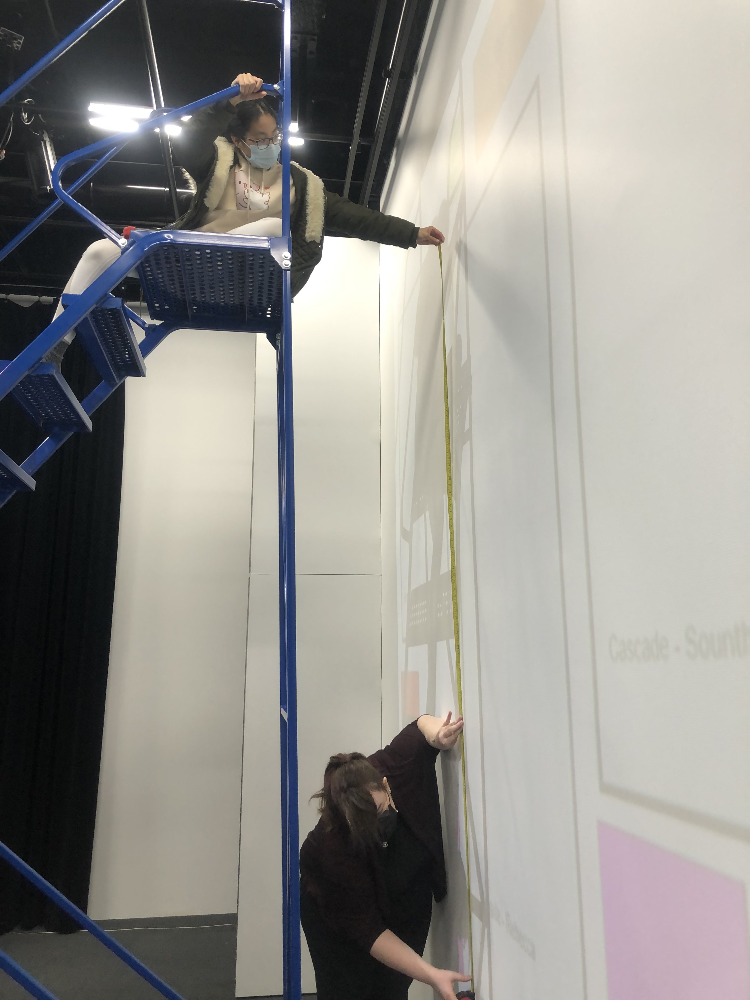
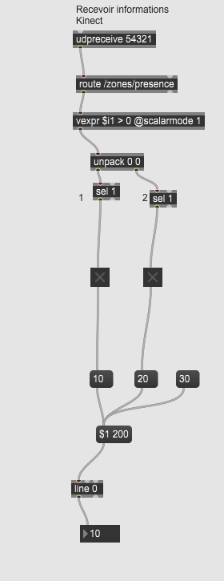

### Est-ce que j'ai accompli l'ensemble des tâches et objectifs que je m'étais fixés pour cette semaine?

- [x] Complètement
- [ ] Assez
- [ ] Peu
- [ ] Pas du tout

#### Décrivez pourquoi.
Oui, mon animation est enfin finie, j'ai pu communiquer de la Kinect à Max directement, j'ai réussit à faire un prototypage d'analyse de données pour qu'ils me renvoient des données de façon *smooth*. J'ai tout fait ce que j'ai planifié de faire cette semaine.

#### S'il y a lieu, qu'allez-vous faire pour remédier à la situation?

### Mon projet s'est-il réalisé selon l’échéancier prévu?

- [x] Complètement
- [ ] Assez
- [ ] Un peu
- [ ] Pas tout à fait

#### S'il y a des écarts, décrivez-les.

#### S'il y a lieu, qu'allez-vous faire pour remédier à la situation?

### Défis pour la prochaine semaine
- Déterminer comment faire jouer une vidéo lorsqu'il y a présence ET que la vidéo s'arrête lorsqu'il n'y a pas présence
- Délimiter les zones d'interactions de la Kinect pour chaque cadre
- Faire l'analyse de présence sur Max de tous les zones d'interaction
- Fusionner les patch Max en un seul patch Max

---

## Semaine de rattrapage

### Résumé des réalisations effectuées
- Ajouter des effets de vidéo dans mon animation, et mon animation est exportée en vidéo MP4
- Acheter les traverses manquantes avec Rebecca au Omer Desserres
- Construire les faux-cadres et les apprêter avec du Gesso
- Fusionner les patch Max en un seul
- Faire commencer une vidéo quand il y a présence et faire arrêter une vidéo quand il n'y a pas de présence
- Délimiter les zones d'interactions de la Kinect 
- Tester l'animation du cadre Averse en temps réel, avec la projection
- J'ai aidé à faire l'accrochage du cadre Averse (interaction de Maloney)

### Image d'une réalisation dont tu es la ou le plus fier

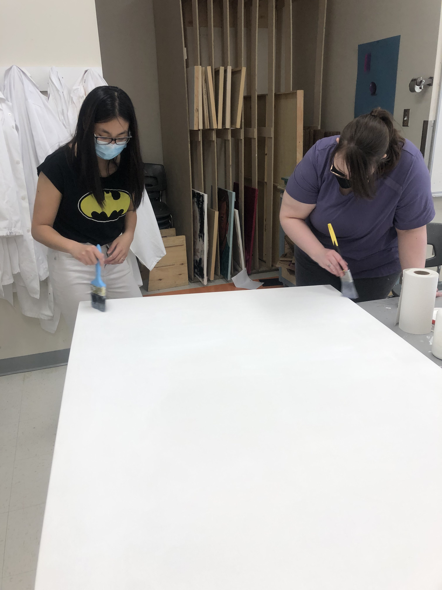
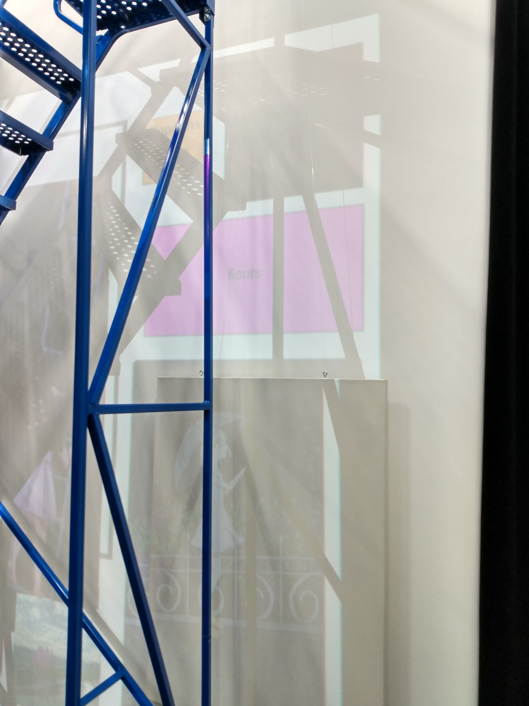
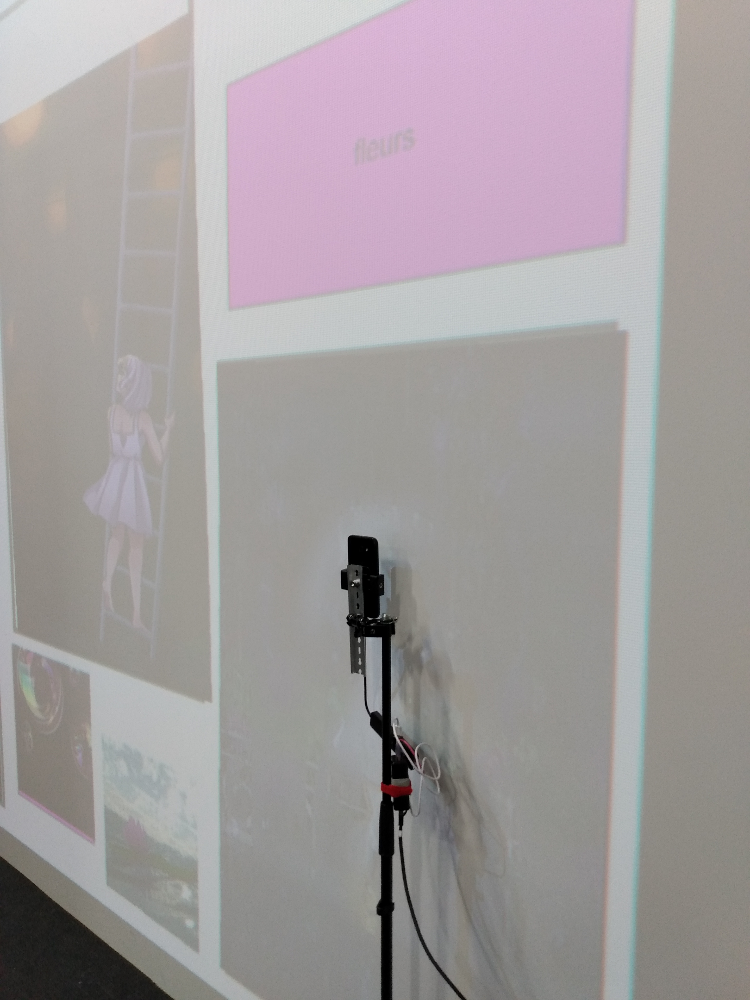

### Est-ce que j'ai accompli l'ensemble des tâches et objectifs que je m'étais fixés pour cette semaine?

- [x] Complètement
- [ ] Assez
- [ ] Peu
- [ ] Pas du tout

#### Décrivez pourquoi.
Oui, ma vidéo est enfin prête à être interagie avec, les zones Kinect ont été définies alors on peut commencer à tester les interactions (l'interaction de Maloney est déjà testable). On est bien avancés!

#### S'il y a lieu, qu'allez-vous faire pour remédier à la situation?
N/A

### Mon projet s'est-il réalisé selon l’échéancier prévu?

- [x] Complètement
- [ ] Assez
- [ ] Un peu
- [ ] Pas tout à fait

#### S'il y a des écarts, décrivez-les.
N/A

#### S'il y a lieu, qu'allez-vous faire pour remédier à la situation?
N/A

### Défis pour la prochaine semaine
- Accrocher tous les cadres
- Relier les zones de Kinect aux interactions correspondantes au Patch Max
- Faire des tests de nos interactions pour voir s'il y a des potentiels bugs

---
