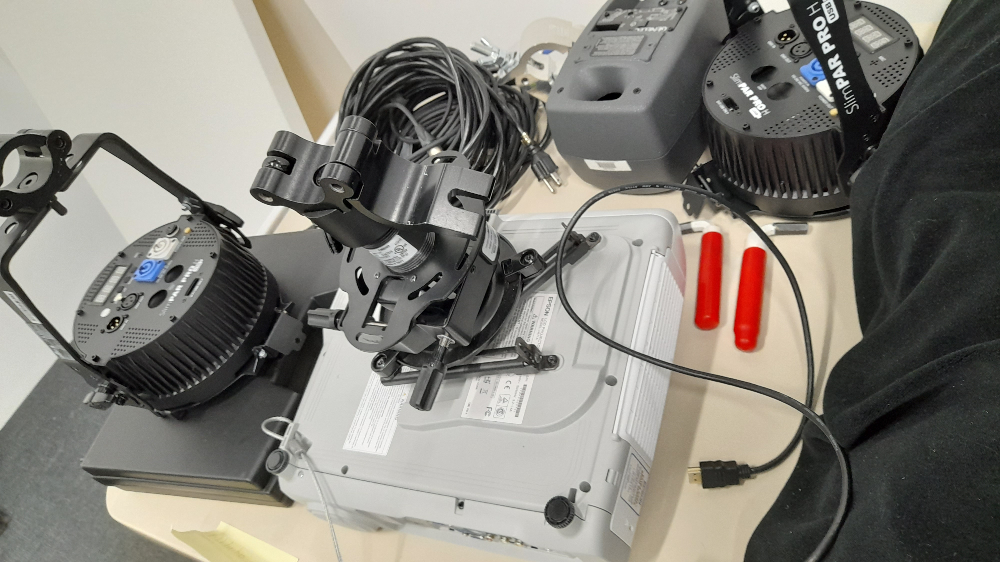
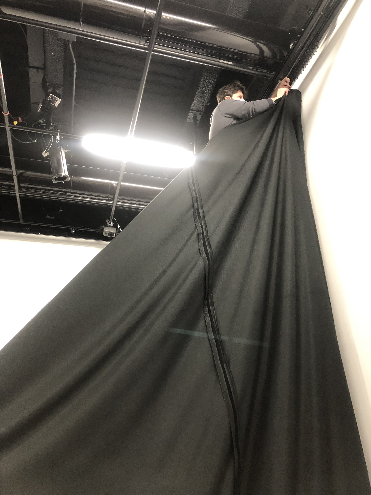
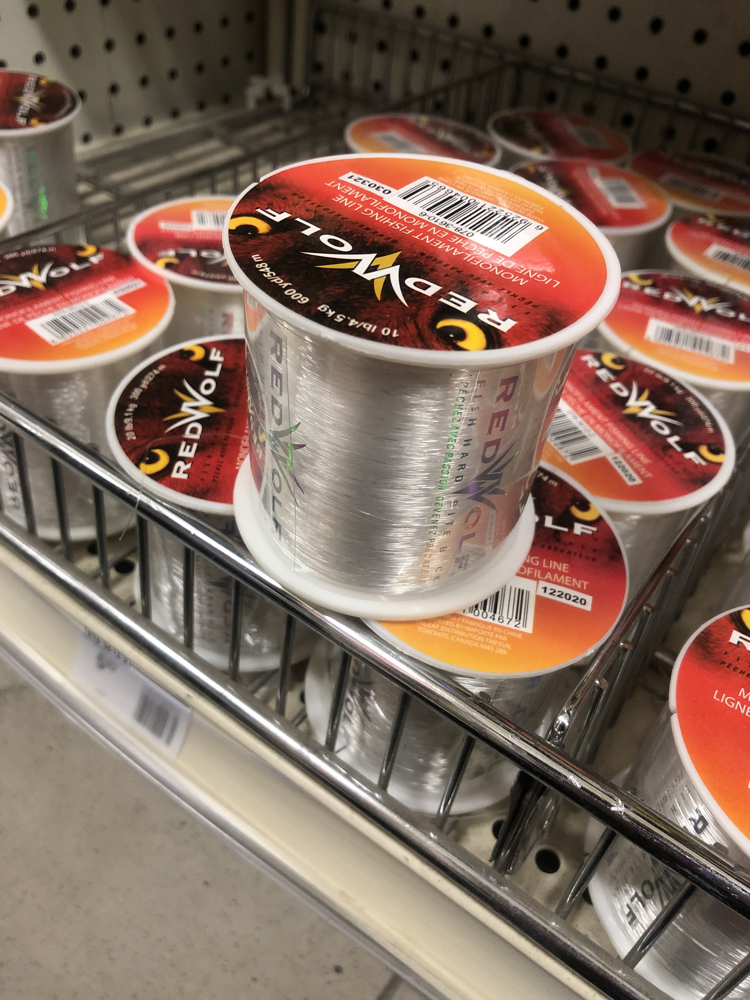
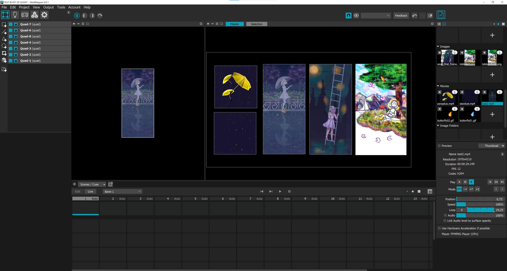
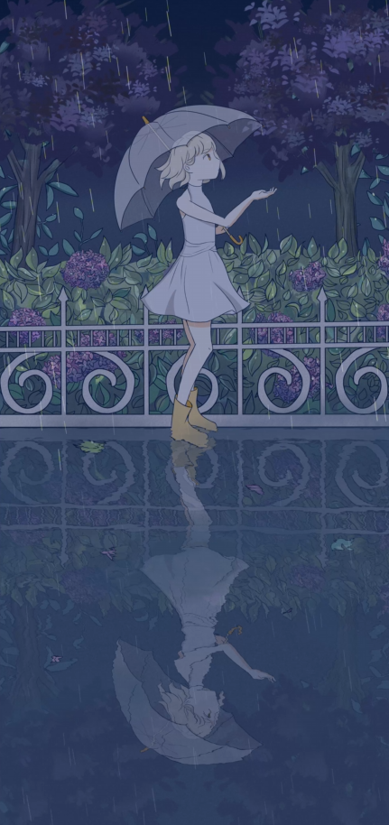
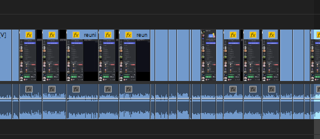
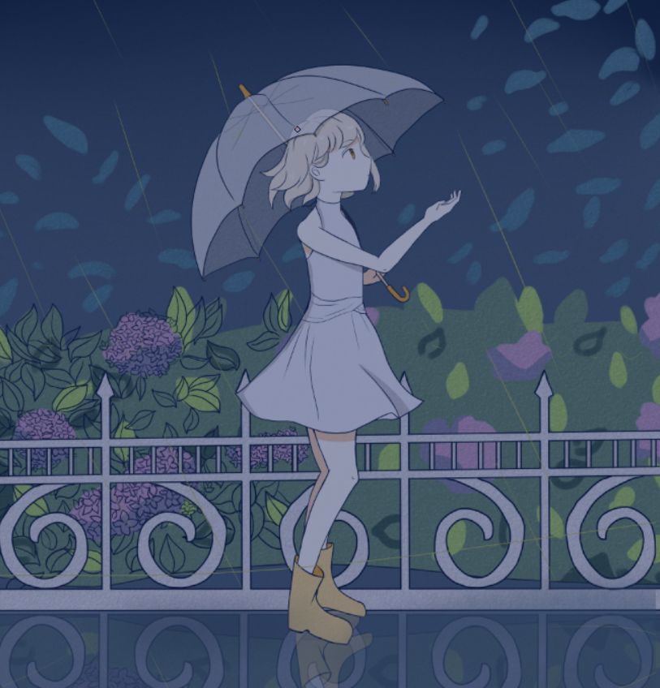

# Journal de création

## Semaine 9
> Contenu personnalisé à remplir par les équipes à chaque semaine faisant part du processus de création: résumé des réalisations d'équipe effectuées et des défis rencontrés sous forme d'un texte; ajout de vidéos, images, documents audios ou de contenu multimédia.)

## Semaine 8

## Semaine 7

## Semaine 6  

Nous avons avancé nos assets visuels:

(https://youtu.be/l0sEsGJ-l1g)

(https://youtu.be/wGgBIxJrjAU)

Émilie a finalisé les effets sonores et la musique d'ambiance. 

Sounthida a optimisé le patch MAX en utilisant un deuxième ordinateur pour l'intéractivité du tableau de Maloney. 

Rebecca a finalisé le logo d'équipe.

En équipe, nous avions effectué des tests pour la projection de tous nos tableaux ensembles. 

Olivier et Sounthida on accroché le système de détection pour l'interactivité du tableau de Maloney sur la toile. Nous avons réussi à ressoudre un problème technique de la direction/orientation de la caméra dans Max. Ils ont découpé un trou dans la toile afin que la camera soit capable de capter la présence de l'interacteur. Ils ont aussi accroché tous les toiles (sauf celle du tableau 3). 

Maloney, Sounthida et Émilie ont coupé et posé de la mousse sur le dos des toiles afin de les stabiliser. 

Maloney a accroché les lumières. Émilie a effectué la programmation des lumières. 

Défis pour la semaine prochaine:

- Finir de monter la toile du tableau 3/noyade (monter,peinture & accrocher)
- Régler le problème de flicker de la Kinect 
- Intégration les effets sonores dans le patch Max 
- Intégration les lumières dans le patch Max  
- Envoi de la vidéo de Maloney d'un autre ordinateur au Madmapper de l'ordinateur principal 
- Création du scénario de la vidéo
- Mapping des vidéos & tester interactions 
- Déplacer les ordinateurs et tables 
- Mettre les queuing poles (dès qu'ils soit disponibles)

## Semaine de rattrappage

Nous avons avancé nos assets visuels:

Olivier et Sounthida se sont occupés de faire les premiers tests d'interactivité avec la kinect et le tableau de Maloney.

Samedi, Rebecca et Sounthida ont acheté les faux-cadres manquants au DeSerres. Mardi, Rebecca, Sounthida, Maloney et Émilie ont travaillé sur l'assemblage des faux-cadres au local d'art. Toutefois, comme il se trouve qu'il y a une erreur avec la taille de certaines traverses, Maloney et Émilie ont dû marcher jusqu'au DeSerres dans une tempête de neige pour aller les échanger. Pendant ce temps, Rebecca et Sounthida ont peinturé les toiles en blanc.

Émilie a travaillé sur la bande sonore de notre projet! 
Voici un lien pour l'écouter: https://drive.google.com/file/d/1XswAye6z4wMyml38-mASnvxl1IaqLt1V/view

### DÉFIS DE LA SEMAINE PROCHAINE

- Finir tous les assets pour mercredi 
- Accrocher tous les cadres avec le fil de pêche
- Connecter les zones de Kinect au patch Max
- Faire plusieurs tests avec les interactions et voir les potentiels problèmes
- Accrocher deux lumières

## Semaine 5

Voici l'avancement des assets visuels :

Mardi: Émilie, Sounthida et Rebecca ont effectué des tests d'accrochage du toile et nous avons découvert que le fil est trop élastique et ne va pas être capable de supporter nos toiles. Nous avons aussi mesuré la taille de notre projection pour déterminer la grandeur de nos faux-cardres. 

Mercredi: Toute l'équipe et les profs ont participé aux ajustements du projecteur et aux discussions à propos de la taille et l'emplacement de la projection. Vu que nous avons bougé le projecteur, nous devons à nouveau reprendre les mesures. Rebecca a modifié le plan des tableaux en conséquence de ces changements et discussions. 

Jeudi: 
- Olivier a installé les speakers. 
- Maloney et Rebecca ont pris à nouveau les mesures des tableaux.
- Maloney, Sounthida, Olivier et Rebecca sont allés procurer les faux-cardres. 

Vendredi: Après la rencontre d'équipe, tout le monde va assister au montage des faux-cardres.

### DÉFIS DE LA SEMAINE PROCHAINE

- Déterminer comment recevoir de la vidéo de Max dans MadMapper
- Fusionner les patch Max dans un seul patch 
- Tester les interactions avec la Kinect en real time
- Construire les faux cadres en Canvas

## Semaine 4

Cette semaine fut très productive, nous avons travaillé sur plusieurs tâches en même temps. Tout d'abord, tout le monde a continué de réaliser leurs assets visuels.

Émilie et Sounthida sont allées au grand studio lundi pour installer le projecteur et dégager les filages.

Maloney, Rebecca et Sounthida ont assisté à une mini-formation de la part de Daryl sur le logiciel Max. Après un peu de confusion, nous avons finalement réussi à fixer nos patchs! Un grand merci au prof de nous avoir aidé! :D

Olivier et Émilie se sont occupés d'installer la Kinect et la barre horizontale.

Olivier et Rebecca ont mis les crochets et les fils de pêche sur le test canvas.

Nous avons réussi à projeter nos projets avec Madmapper sur le projecteur.

Nous avons réussi à connecter le son de l'ordinateur aux hauts-parleurs avec la carte de son.

### DÉFIS DE LA SEMAINE PROCHAINE
- Nous aimerions pouvoir accrocher les haut-parleurs et les lumières au plafond.
- Nous espérons pouvoir mesurer la hauteur des cadre afin de savoir combien de faux-cadres et de quelles longueurs nous avons besoin pour créer nos canvas. Ce serait aussi bien de visiter le magasin DeSerres pour les voir en personne.
- Nous voulons continuer à travailler sur les assets visuels.
- Nous voudrions faire plus de tests avec la Kinect/Max/Madmapper.
- Nous voulons accrocher le Canvas test 

## Semaine 3

Tout le monde a encore travaillé dur sur leurs assets visuels.

 

Nous avons refilmé et mise en ligne la vidéo de préproduction : https://youtu.be/SATIxHCn6SI 

Rebecca a amené deux canvas afin que l'on puisse avoir un aperçu rapide ou faire des tests avec des cadres déjà faits, qui ont presque la taille des canvas que l'on veut. Elle a aussi amené du toiles brut. 
 

Olivier est venu récupérer et scanner le matériel requis pour le projet.

Maloney, Sounthida, Émilie et Olivier ont débuté l'installation du projet. Ils ont désinstallé des rideaux (puisque ses crochets vont être utilisés pour attacher les fils de pêche) et un projecteur. Le rideau était lourd mais nous avons réussit à le plier!

Enlever le projecteur était effrayant car c'était la première fois qu'on le faisait, on avait peur d'échapper un projecteur!

Maloney et Émilie sont parties acheter le fil de pêche qui va nous permettre d'accrocher les canvas. Elles ont dû braver le froid et la pluie pour aller marcher jusqu'au Canadian Tire.

Maloney, Sounthida, Émilie et Olivier ont travaillé un peu sur MadMapper afin de découvrir le logiciel, pour pouvoir ensuite faire des tests de projection lorsque le porjecteur sera installé.

### DÉFIS DE LA SEMAINE PROCHAINE
- Émilie et Sounthida ont réservé le Grand Studio de 9h à 11h le lundi afin d'installer le projecteur.
- On espère pouvoir mesurer la hauteur des cadre dès la semaine prochaine afin de savoir combien de faux-cadres et de quelles longueurs nous avons besoin pour créer nos canvas.
- On espère aussi pouvoir accrocher les cadres de Rebecca afin de faire des tests de projection sur canvas préliminaires.
- Nous allons assister à une petite formation de groupe avec Daryl et Guillaume pour fixer nos patchs Max.

## Semaine 2

Tout le monde a commencé les assets visuels.

 
 
 

Nous avons enregistré quelques effets sonores, dont celui de la pluie et celui de la chute d'eau.

Nous avons fait une réunion pour corriger notre vidéo.

Nous avons fait une rencontre pour les enjeux techniques que notre projet requiert (canvas et caméra cachée pour le cadre de Maloney).

## Semaine 1

Cette semaine a plutôt été une semaine ou nous nous sommes remis la tête dans le projet, et que nous avions discuté plus que autre chose à propos des changements du projet, puisque nous revenions d'un long mois de vacances.

Nous avons d'abord réorganisé notre document Préproduction de GitHub ensemble, afin de le remettre à jour selon nos nouvelles idées et nouveaux rajustements.

Nous avons planifié un jour de rencontre afin de réaliser la vidéo pour la préproduction, puis Émilie a fait le montage de la vidéo.

Sounthida et Maloney ont commencé les croquis pour leurs tableaux.

