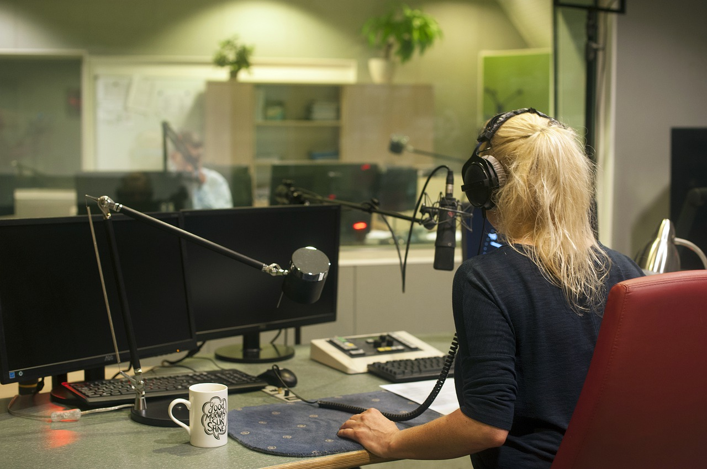
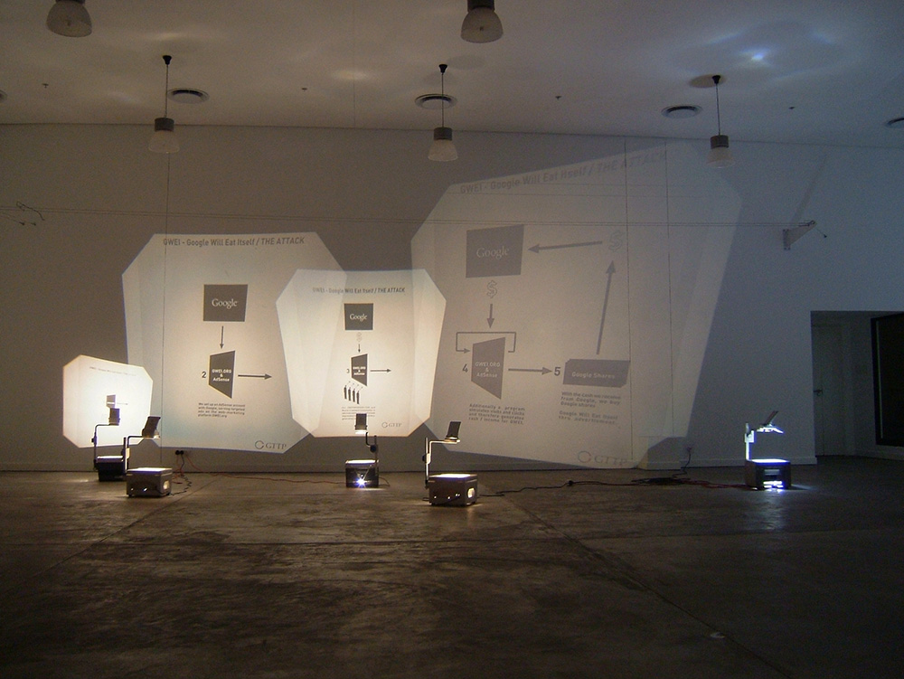

# Journal de création

## Semaine 9
> Contenu personnalisé à remplir par les équipes à chaque semaine faisant part du processus de création: résumé des réalisations d'équipe effectuées et des défis rencontrés sous forme d'un texte; ajout de vidéos, images, documents audios ou de contenu multimédia.)

Cette semaine a été parsemée de défis.

Tout d’abord, comme prévu, nous avons terminé de créer nos images dans Photoshop et le contenu 3D dans Maya. Nous avons également avancé la programmation multimédia du projet dans le logiciel Max et Unity.

Par la suite, nous avions prévu une séance d’enregistrement audio dans les studios de son. Cependant, misère (!), une panne d’électricité a eu lieu durant notre séance! Nous avons donc dû remettre celle-ci à quelques jours plus tard. (Nous avons beaucoup ri de cette situation.)

Enfin, nous venons de commencer à mettre en espace le projet dans le grand studio du collège. Nos projecteurs viennent tout juste d’être installés! 

On a bien hâte de voir le projet se concrétiser davantage dans les lieux physiques. À suivre

## Semaine 8

## Semaine 7

## Semaine 6

## Semaine 5

## Semaine 4

## Semaine 3

## Semaine 2

## Semaine 1

Cette semaine a plutôt été une semaine ou nous nous sommes remis la tête dans le projet, et que nous avions discuté plus que autre chose à propos des changements du projet, puisque nous revenions d'un long mois de vacances.

Nous avons d'abord réorganisé notre document Préproduction de GitHub ensemble, afin de le remettre à jour selon nos nouvelles idées et nouveaux rajustements.

Nous avons planifié un jour de rencontre afin de réaliser la vidéo pour la préproduction, puis Émilie a fait le montage de la vidéo.

Sounthida et Maloney ont commencé les croquis pour leurs tableaux.

