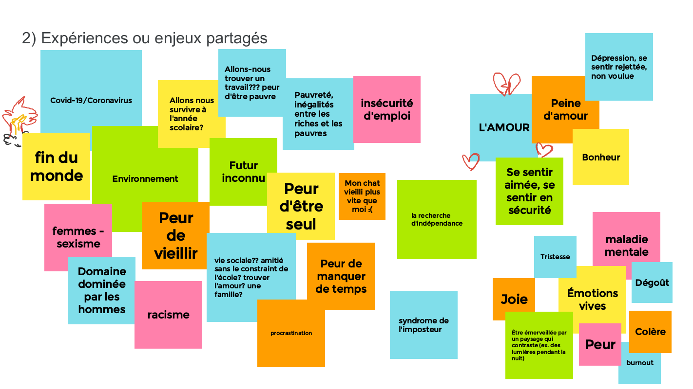
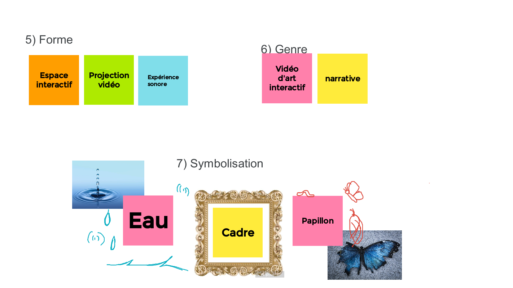
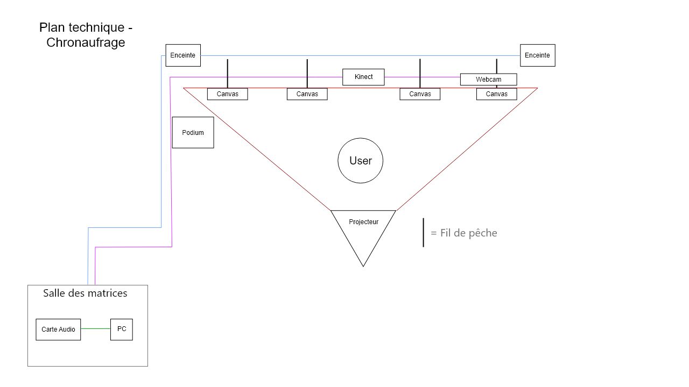

# Préproduction
> C'est ici qu'on dépose les éléments de la préproduction.

# Table des matières
1. [Intention ou concept](#Intention-ou-concept)
    - [Cartographie](#Cartographie)
    - [Intention de départ](#Intention-de-départ)
    - [Synopsis](#Synopsis)
    - [Tableau d'ambiance (*moodboard*)](#Tableau-d'ambiance-(*moodboard*))
    - [Scénario, scénarimage ou document audio/visuel](#Scénario,-scénarimage-ou-document-audio/visuel)
2. [Planification technique d'un prototype (devis technique)](#Planification-technique-(devis-technique))
    - [Schémas ou plans techniques](#Schémas-ou-plans-techniques)
    - [Matériaux requis](#Matériaux-de-scénographie-requis)
    - [Équipements requis](#Équipements-requis)
    - [Logiciels requis](#Logiciels-requis)
    - [Ressources humaines requises](#Ressources-humaines-requises)
    - [Ressources spatiales requises (rangement et locaux)](#Ressources-spatiales-requises-(rangement-et-locaux))
    - [Contraintes techniques et potentiels problèmes de production](#Contraintes-techniques-et-potentiels-problèmes-de-production)
3. [Planification de la production d'un prototype (budget et étapes de réalisation)](#Planification-de-la-production-(budget-et-étapes-de-réalisation))
    - [Budget prévisionnel](#Budget-prévisionnel)
    - [Échéancier global](#Échéancier-global)
    - [Liste des tâches à réaliser](#Liste-des-tâches-à-réaliser)
    - [Rôles et responsabilités des membres de l'équipe](#Rôles-et-responsabilités-des-membres-de-l'équipe))
    - [Moments des rencontres d'équipe](#Moments-des-rencontres-d'équipe)

# Intention ou concept
## Cartographie

## Intention de départ
Par ce projet, nous souhaitons exposer la pression vécue dans notre société de devoir être toujours plus productives afin d'exprimer la nécessité de prendre des pauses ou du temps pour soi.  Nous souhaitons ainsi faire valoir l’importance du temps « mort » et « improductif » pour s’accomplir comme humain. 

## Synopsis
L'oeuvre prends la forme d'un musée. Le participant rentre dans l'univers en marchant sur un tapis et en mettant une paire d'écouteurs. Devant lui se trouve 4 grands tableaux immobiles. Quand le participant s'arrête et fait face à un des grands tableaux, ce dernier s'anime, la fille dans le tableau semble stressée lorsque l'interacteur arrive. Une caméra kinect capture son ombre et la projette sur le tableau correspondant. 

## Tableau d'ambiance (*moodboard*)

### Moodboard d'ambiance générale

### Moodboard personnage

### Moodboard du premier tableau

### Moodboard du deuxième tableau

### Moodboard du troisième tableau

### Moodboard du quatrième tableau

### Moodboard du cinquième tableau

## Scénario, scénarimage ou document audio/visuel
* Taille de la scène totale: 1130px (x 2) x 720 = 2260px x 720px
* Taille de chaque section: 410px x 720px (ratio 0.56)

### Scénarimage tableau 01 (Maloney)

### Scénarimage tableau 02 (Sounthida)
 

### Scénarimage tableau 03 (Rebecca)

 

### Scénarimage tableau 03.5 (Olivier)

### Scénarimage tableau 04 (Émilie)

### Effets techniques

### Tableau 01 (Maloney)

### Tableau 02 (Sounthida)
La vitesse du vidéo est influencé par la position de l'utilisateur. La composition est affectée.

### Tableau 03 (Rebecca)
Le tableau a un effet de dioporama numérique et la composition est affectée par la position de l'utilisateur.
https://www.youtube.com/watch?v=TzPh66LVGwA&t=27s 
 

Nous voulons avoir un effet de diaporama/depth mapping avec la détection de présence. La position des éléments seront affecté par la position de l'utilisateur. Voici un exemple à ce que cet effet pourait ressembler.  

### Tableau 03.5 (Olivier)
La vidéo joue en loop.

### Tableau 04 (Émilie)
La vitesse du vidéo est influencé par la position de l'utilisateur. Seuelement l'eau est affecté. 

# Planification technique d'un prototype (devis technique)
## Schémas ou plans techniques
> Insérer plans, documents et schémas pertinents dans cette sectio.  

### Plan de travail

### Plantation 

### Schéma de branchement 

## Matériel de scénographie requis

> Liste des matériaux de scénographie (matériaux de décor) requis ou lien vers un tableur Excel ou document Markdown à part si nécessaire (quantité, spécifications techniques, lien vers fiche technique si applicable, commentaires...)

* Tapis rouge ([location](https://www.citefetes.com/boutique/tap01_828/))
* Table avec nappe
* Pôle d'attente (si on peut emprunter du collège)
* Manuel de visiteurs [Amazon.ca](https://www.amazon.ca/Obsidian-Journal-Diary-Notebook-Pauper/dp/1441310584/ref=sr_1_6?dchild=1&keywords=notebook+fancy&qid=1635121683&sr=8-6)
* Podium (facultatif)

## Équipements requis
> Liste des équipements requis par département ou lien vers un tableur Excel ou document Markdown à part si nécessaire (quantité, spécifications techniques, lien vers fiche technique si applicable, commentaires...)

* Audio
    * Écouteurs à fil avec grande rallonge
    * Carte de son

* Vidéo
    * 1 (ou 2) projecteurs vidéo lentille standard
    * 1 ou 2 système d'acrochage pour projecteurs
    * 5 supports à Kinect
    * 5 kinects / webcam

* Lumière
    * Lumière de table de chevet

* Électricité
    * 2 extentions 3 fiches et 3 conducteurs 

* Réseau
    * 4 fils cat6a de 15"
    * Switch poe 5 ports

* Ordinateur
    * 1 ordinateur portable 
    
* Autre
    * Tout autre élément pertinant

## Logiciels requis
> Liste des logiciels requis, version ainsi que leurs dépendences

* [Autodesk Maya](https://www.autodesk.ca/en/products/maya/overview?term=1-YEAR&tab=subscription)
* [OBS Studio](https://obsproject.com/)
* [Adobe Premiere Pro](https://www.adobe.com/ca/products/premiere.html)
* [Adobe After Effects](https://www.adobe.com/ca/products/aftereffects.html)
* [Reaper](https://www.reaper.fm/)
* [Max 8](https://cycling74.com/products/max)
* [Madmapper](https://madmapper.com/)

Pour les dessins:
* Adobe Photoshop, Paint Tool Sai, Krita, Procreate

## Ressources humaines requises
> Formaté en liste ou en lien vers un tableur Excel.

* TTP, location de matériel
* Professeur pour nous supporter et répondre aux questions

## Ressources spatiales requises (rangement et locaux)
> Spécifications des espaces nécessaires formaté en liste ou lien vers un tableur Excel.

* Grand studio
    * Projection vidéo sur la section du mur en face de la porte du studio
    * Captation vidéo

## Contraintes techniques et potentiels problèmes de production
> Tableau ou lien vers un tableur Excel (contraintes, problème et solution envisagée, commentaires...)

| Contrainte ou problème potentiel                 | Solution envisagée                                    | Commentaires                                                                                 |
|--------------------------------------------------|-------------------------------------------------------|----------------------------------------------------------------------------------------------|
| Nous n'avons jamais utilisé de projection avec Kinect | Formation avec TTP, expérimentation durant la session, questions au professeur | Sinon, nous pourrions changer la façon de détecter le mouvement ou changer l'élément qui permet de déclencher le mouvement |
| Comment programmer l’interactivité | Formation avec TTP, expérimentation durant la session, questions au professeur | Solution |
| Bien définir notre interactivité | Rencontre d'équipe avec prof | Ajouter un cadre ou il y l'intéracteur (caméra) |
| Tester les overlays dans différents logiciels de montage vidéo | Tests | Tests sur logiciels différents et différents effets d'overlay |
| Valider si Montmorency possède le matériel qu’on demande | Aller voir à la Vie Étudiante de Momo | Sinon, on peut trouver des matériels alternatifs 

# Planification de la production d'un prototype (budget et étapes de réalisation)
## Budget prévisionnel

[Lien vers document](medias/Budget.xlsx)

## Échéancier global
Étapes importantes du projet visualisé dans GitHub (*milestones*):  
https://github.com/Blobduckies/musee_de_la_vie/milestones

*Dates importantes :*
- Première itération : lundi 30 novembre
- Prototype finale : lundi 10 décembre
- Présentation des projets devant public : jeudi 25 mars (soir).    

## Liste des tâches à réaliser 
Visualisation des tâches à réaliser dans GitHub selon la méthode Kanban:  
https://github.com/Blobduckies/musee_de_la_vie/projects/1

Inventaire des tâches à réaliser dans GitHub selon le répertoire d'*issues*:  
https://github.com/Blobduckies/musee_de_la_vie/issues

## Rôles et responsabilités des membres de l'équipe
> Il vous est proposé ici de nommer une personne à la coordination générale du projet, à la coordination technique et à la coordination artistique. Les grandes décisions sur les grandes orientations du projet devraient se prendre en groupe lors de rencontres d'équipe. Cependant, les décisions entre vos rencontres de groupe devraient appartenir à ces personnes.

**Maloney Khim**
- Illustration du tableau 01, animation et colorisation;
- Illustration de deux petits tableaux
- Trouver les éléments du décor

Liste des tâches dans Git Hub:  
https://github.com/Blobduckies/musee_de_la_vie/issues?q=assignee%3Amaloneykhim+is%3Aopen 
https://github.com/Blobduckies/musee_de_la_vie/projects/1?card_filter_query=assignee%3Amaloneykhim

**Émilie Fontaine**
- Coordination générale du projet (coordination de l'échéancier, du budget, suivi de la liste des tâches à réaliser, s'assurer de la répartition du rôle et des responsabilités des membres de l'équipe);
- Illustration du tableau 05, animation et colorisation;
- Illustration de deux petits tableaux

Liste des tâches dans Git Hub:  
https://github.com/Blobduckies/musee_de_la_vie/issues?q=assignee%3Aemiliefontaine+is%3Aopen
https://github.com/Blobduckies/musee_de_la_vie/projects/1?card_filter_query=assignee%3Aemiliefontaine

**Rebecca Pilotte**
- Coordination artistique (attention plus particulière pour s'assurer que l'intention/concept artistique du projet initial reste, sinon consulter les membres de l'équipe);
- Illustration du tableau 03, animation et colorisation;
- Illustration de deux petits tableaux

Liste des tâches dans Git Hub:  
https://github.com/Blobduckies/musee_de_la_vie/issues?q=assignee%3ABkkaaa+is%3Aopen
https://github.com/Blobduckies/musee_de_la_vie/projects/1?card_filter_query=assignee%3Abkkaaa

**Olivier Lalonde**
- Modélisation et animation 3D du tableau 04
- Tester la projection
- Tester le son

Liste des tâches dans Git Hub:  
https://github.com/Blobduckies/musee_de_la_vie/issues?q=assignee%3AS4nic+is%3Aopen
https://github.com/Blobduckies/musee_de_la_vie/projects/1?card_filter_query=assignee%3As4nic

**Sounthida Kong**
- Illustration du tableau 02, animation et colorisation;
- Illustration de deux petits tableaux
- Tester la Kinect

Liste des tâches dans Git Hub:  
https://github.com/Blobduckies/musee_de_la_vie/issues?q=assignee%3ASounthi+is%3Aopen
https://github.com/Blobduckies/musee_de_la_vie/projects/1?card_filter_query=assignee%3Asounthi

**Tâches pas encore attribuées**  
https://github.com/Blobduckies/musee_de_la_vie/issues?q=is%3Aopen+is%3Aissue+no%3Aassignee

## Inventaire des médias
Tableau de l'inventaire des médias à réaliser / à trouver.
https://docs.google.com/spreadsheets/d/1NA115m_GSag19zl8HwUQhka4C-CUOffIUMqOuchhcaI/edit?usp=sharing

## Moments des rencontres d'équipe
Hebdomadaire
- **Dimanche de 19h à 20h**: Rencontre de suivi de projet (mêlée)

## Lieu d'archivage

One Drive, on met tout dans un dossier d'équipe qui s'appelle Blobduckies, on va avoir un dossier de versions finales et un dossier pour chaque membre de l'équipe. Si un membre veut drop un dossier sur le One Drive, il faut qu'il le met en version .zip. Pour les fichiers normaux ils le drop sur leurs dossier directement.

On utilise GitHub pour l'organisation et pour partager les codes, se référer aux sources (moodboard, etc.) ( One Drive c'est plutôt pour les médias lourds (rendus 3D, vidéos).

## Tests de prototypage 
Nous avons effectué divers tests au cours de la session. Voici une documentation en image de ce que nous avons fait. 

### Recherche d'interactivité
Nous avons joué avec plusieurs effets de vidéo dans MAX pour nous inspirer.

AU final, une simple incrustation à été jugée comme tant insufisante. Nous countinuons nos recherches. 

### Prototypage projecteur wide

Ombre grandement présente, il faut être à 5 pieds du mur pour ne pas que l'ombre paraisse, ce uqi ne marche pas De plus, la maquette en 16:10 ne marche pas à cause de l'adaptateur en 16:9.On nous suggère de tester avec un projecteur ultra wide.  

Suite à ces tests, Rebecca a refait une nouvelle maquette dans le bon format. 

### Test avec le projecteur ultra-wide

Sounthida et Émilie sont parties dans le grand studio pour installer le nouveau modèle de projecteur avec l'aide de Guillaume. Le projecteur fait paraître de l'ombre que si l'on se tient à deux pieds du mur. On peut donc s'approcher très proche des oeuvres sans problème. 

#### Malheureusement, il y a une dégradation floue vers le bas de l'image.

Olivier a tenté de règler le focus, sans succès. Après consultation avec Guillaume, il nous a informé qu'il suffisait de rapprocher le projecteur ultra wide du mur pour corriger la situation. 

#### Malheureusement, lorsque l'on rapproche le projecteur au point qu'il n'y a plus de flou, alors la projection est trop petite.

Après avoir parlé avec Guillaume, nous n'avons pas pu trouver de solutions avec l'ultra-wide. La seule solution est de changer le projecteur pour le projecteur wide avec ombre. À suivre...

### Prototypage vidéo Max à OBS (avec Spout)

### Prototypage Tableau #01 (pour interactivité effet buée)

Au début, Maloney a essayé de faire effacer la vidéo de la buée avec des couches blanches et noires dans Max mais ça a donné un effet trop lumineux.

Après quelque tests, ce problème a été résolu. Nous avons maintenant un code Max permettant à un interacteur d'effacer un filtre de buée par dessus une image.

https://youtu.be/kUIWhbcGvUU

### Prototypage Tableau #02 (pour changement de vitesse selon position)

### Prototypage Tableau #03 (pour depth field, changement de perspective)

Nous voulons avoir un effet de diaporama/depth mapping avec la détection de présence. La position des éléments seront affecté par la position de l'utilisateur. 

 
Voici un exemple de test dans Max où l’un peut contrôler la position des éléments du tableau.

### Prototypage Tableau #05 (effets OBS pour transposer une partie de la vidéo/image)

C'est un succès! Nous avons maintenant un code Max permettant la transposition d'image de Max vers OBS 

### Prototypage code de détection de présence qui permets d'allumer une lumière selon l'emplacement de l'interacteur
Émilie et Sounthida ont créé un code puredata communiquant avec une kinect et un rasberry pi afin de faire allumer différentes lumières selon la position de l'interacteur. 

Un grand succès! Il ne reste plus qu'à convertir ce code en code Max.

### Prochaines étapes

- Tester le patch Max avec la Kinect pour détection + activation de la vidéo + accélération
- Finir le patch Max pour l'interaction du tableau 04 et le tester au Grand Studio.
- Installer une deuxième Kinect? Ou monter la Kinect plus haute?
- Changer le projecteur ultra-wide pour installer un projecteur wide
- Installer des hauts-parleurs et tester le son au Grand Studio
- Réaliser nos vidéos en exécutant les dessins
- Réaliser notre son d'ambiance et sons d'eau
