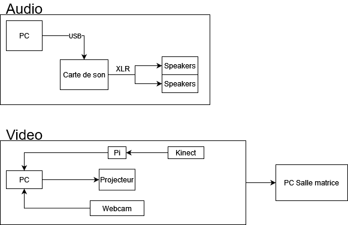
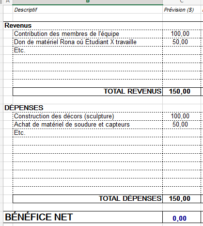

# Préproduction
> C'est ici qu'on dépose les éléments de la préproduction.

# Table des matières
1. [Intention ou concept](#Intention-ou-concept)
    - [Cartographie](#Cartographie)
    - [Intention de départ](#Intention-de-départ)
    - [Synopsis](#Synopsis)
    - [Tableau d'ambiance (*moodboard*)](#Tableau-d'ambiance-(*moodboard*))
    - [Scénario, scénarimage ou document audio/visuel](#Scénario,-scénarimage-ou-document-audio/visuel)
2. [Planification technique d'un prototype (devis technique)](#Planification-technique-(devis-technique))
    - [Schémas ou plans techniques](#Schémas-ou-plans-techniques)
    - [Matériaux requis](#Matériaux-de-scénographie-requis)
    - [Équipements requis](#Équipements-requis)
    - [Logiciels requis](#Logiciels-requis)
    - [Ressources humaines requises](#Ressources-humaines-requises)
    - [Ressources spatiales requises (rangement et locaux)](#Ressources-spatiales-requises-(rangement-et-locaux))
    - [Contraintes techniques et potentiels problèmes de production](#Contraintes-techniques-et-potentiels-problèmes-de-production)
3. [Planification de la production d'un prototype (budget et étapes de réalisation)](#Planification-de-la-production-(budget-et-étapes-de-réalisation))
    - [Budget prévisionnel](#Budget-prévisionnel)
    - [Échéancier global](#Échéancier-global)
    - [Liste des tâches à réaliser](#Liste-des-tâches-à-réaliser)
    - [Rôles et responsabilités des membres de l'équipe](#Rôles-et-responsabilités-des-membres-de-l'équipe))
    - [Moments des rencontres d'équipe](#Moments-des-rencontres-d'équipe)

# Intention ou concept
## Cartographie

## Intention de départ
Par ce projet, nous souhaitons exposer la pression vécue dans notre société de devoir être toujours plus productives afin d'exprimer la nécessité de prendre des pauses ou du temps pour soi.  Nous souhaitons ainsi faire valoir l’importance du temps « mort » et « improductif » pour s’accomplir comme humain. 

## Synopsis
L'oeuvre prends la forme d'un musée. Le participant rentre dans l'univers en marchant sur un tapis et en mettant une paire d'écouteurs. Devant lui se trouve 4 grands tableaux immobiles. Quand le participant s'arrête et fait face à un des grands tableaux, ce dernier s'anime, la fille dans le tableau semble stressée lorsque l'interacteur arrive. Une caméra kinect capture son ombre et la projette sur le tableau correspondant. 

## Tableau d'ambiance (*moodboard*)

### Moodboard d'ambiance générale

### Moodboard personnage

### Moodboard du premier tableau

### Moodboard du deuxième tableau

### Moodboard du troisième tableau

### Moodboard du quatrième tableau

### Moodboard du cinquième tableau

## Scénario, scénarimage ou document audio/visuel

### Scénarimage tableau 01

### Scénarimage tableau 02
 

### Scénarimage tableau 03
 *****EN PRODUCTION

### Scénarimage tableau 04

# Planification technique d'un prototype (devis technique)
## Schémas ou plans techniques
> Insérer plans, documents et schémas pertinents dans cette sectio.  

### Plantation 

### Schéma de branchement 

## Matériel de scénographie requis

> Liste des matériaux de scénographie (matériaux de décor) requis ou lien vers un tableur Excel ou document Markdown à part si nécessaire (quantité, spécifications techniques, lien vers fiche technique si applicable, commentaires...)

* Tapis rouge ([location](https://www.citefetes.com/boutique/tap01_828/))
* Table avec nappe
* Pôle d'attente (si on peut emprunter du collège)
* Manuel de visiteurs [Aliexpress](https://www.aliexpress.com/item/4000558108816.html?spm=a2g0o.productlist.0.0.4c55315e1Qcq9b&algo_pvid=abadca4a-ed96-40aa-8610-f89e12cd8da4&algo_exp_id=abadca4a-ed96-40aa-8610-f89e12cd8da4-3&pdp_ext_f=%7B%22sku_id%22%3A%2210000002927777715%22%7D)
* Podium (facultatif)

## Équipements requis
> Liste des équipements requis par département ou lien vers un tableur Excel ou document Markdown à part si nécessaire (quantité, spécifications techniques, lien vers fiche technique si applicable, commentaires...)

* Audio
    * Écouteurs à fil avec grande rallonge
    * Carte de son

* Vidéo
    * 1 (ou 2) projecteurs vidéo lentille standard
    * 1 ou 2 système d'acrochage pour projecteurs
    * 5 supports à Kinect
    * 5 kinects / webcam

* Lumière
    * Lumière de table de chevet

* Électricité
    * 2 extentions 3 fiches et 3 conducteurs 

* Réseau
    * 4 fils cat6a de 15"
    * Switch poe 5 ports

* Ordinateur
    * 1 ordinateur portable 
    
* Autre
    * Tout autre élément pertinant

## Logiciels requis
> Liste des logiciels requis, version ainsi que leurs dépendences

* [Autodesk Maya](https://www.autodesk.ca/en/products/maya/overview?term=1-YEAR&tab=subscription)
* [OBS Studio](https://obsproject.com/)
* [Adobe Premiere Pro](https://www.adobe.com/ca/products/premiere.html)
* [Adobe After Effects](https://www.adobe.com/ca/products/aftereffects.html)
* [Reaper](https://www.reaper.fm/)
* [Max 8](https://cycling74.com/products/max)

Pour les dessins:
* Adobe Photoshop, Paint Tool Sai, Krita, Procreate

## Ressources humaines requises
> Formaté en liste ou en lien vers un tableur Excel.

* TTP, location de matériel
* Professeur pour nous supporter et répondre aux questions

## Ressources spatiales requises (rangement et locaux)
> Spécifications des espaces nécessaires formaté en liste ou lien vers un tableur Excel.

* Grand studio
    * Projection vidéo sur la section du mur en face de la porte du studio
    * Captation vidéo

## Contraintes techniques et potentiels problèmes de production
> Tableau ou lien vers un tableur Excel (contraintes, problème et solution envisagée, commentaires...)

| Contrainte ou problème potentiel                 | Solution envisagée                                    | Commentaires                                                                                 |
|--------------------------------------------------|-------------------------------------------------------|----------------------------------------------------------------------------------------------|
| Nous n'avons jamais utilisé de projection avec Kinect | Formation avec TTP, expérimentation durant la session, questions au professeur | Sinon, nous pourrions changer la façon de détecter le mouvement ou changer l'élément qui permet de déclencher le mouvement || Nous ne sommes pas sûrs si un projecteur suffit
|                           Faire des tests dans le Grand Studio                       |                 Prendre deux projecteurs au lieu de un                                      |                                                                                              |
|                                                  |                                                       |                                                                                              |

# Planification de la production d'un prototype (budget et étapes de réalisation)
## Budget prévisionnel
 *******EN PRODUCTION**

[Lien vers document](https://cmontmorency365.sharepoint.com/:x:/s/TIM-58266B-Expriencemultimdiainteractive-Enseignants/ERS3zx4iKAlLn03N_0h3cyQBOV_nxNuKvrKnqmrXGcgDYg?e=Rjq9Uc)

## Échéancier global
Étapes importantes du projet visualisé dans GitHub (*milestones*):  *****EN PRODUCTION
https://github.com/tim-montmorency/66B-modele_de_projet/milestones

*Dates importantes :*
- Première itération : lundi x novembre
- Prototype finale : lundi x décembre
- Présentation des projets devant public : jeudi 25 mars (soir).    

## Liste des tâches à réaliser *****EN PRODUCTION
Visualisation des tâches à réaliser dans GitHub selon la méthode Kanban:  
https://github.com/tim-montmorency/66B-modele_de_projet/projects/2?add_cards_query=is%3Aopen

Inventaire des tâches à réaliser dans GitHub selon le répertoire d'*issues*:  
https://github.com/tim-montmorency/66B-modele_de_projet/issues

*****EN PRODUCTION

## Rôles et responsabilités des membres de l'équipe
> Il vous est proposé ici de nommer une personne à la coordination générale du projet, à la coordination technique et à la coordination artistique. Les grandes décisions sur les grandes orientations du projet devraient se prendre en groupe lors de rencontres d'équipe. Cependant, les décisions entre vos rencontres de groupe devraient appartenir à ces personnes.

**Maloney Khim**
- Illustration du tableau 01, animation et colorisation;
- Illustration de deux petits tableaux
- Trouver les éléments du décor

Liste des tâches dans Git Hub:  
https://github.com/tim-montmorency/66B-modele_de_projet/issues/assigned/DarylMomo  
https://github.com/tim-montmorency/66B-modele_de_projet/projects/2?card_filter_query=assignee%3Adarylmomo

**Émilie Fontaine**
- Coordination générale du projet (coordination de l'échéancier, du budget, suivi de la liste des tâches à réaliser, s'assurer de la répartition du rôle et des responsabilités des membres de l'équipe);
- Illustration du tableau 05, animation et colorisation;
- Illustration de deux petits tableaux

Liste des tâches dans Git Hub:  
https://github.com/tim-montmorency/66B-modele_de_projet/issues/assigned/gllmAR
https://github.com/tim-montmorency/66B-modele_de_projet/projects/2?card_filter_query=assignee%3Agllmar

**Rebecca Pilotte**
- Coordination artistique (attention plus particulière pour s'assurer que l'intention/concept artistique du projet initial reste, sinon consulter les membres de l'équipe);
- Illustration du tableau 03, animation et colorisation;
- Illustration de deux petits tableaux

Liste des tâches dans Git Hub:  
https://github.com/tim-montmorency/66B-modele_de_projet/issues/assigned/DarylMomo  
https://github.com/tim-montmorency/66B-modele_de_projet/projects/2?card_filter_query=assignee%3Adarylmomo

**Olivier Lalonde**
- Modélisation et animation 3D du tableau 04
- Tester la projection
- Tester le son

Liste des tâches dans Git Hub:  
https://github.com/tim-montmorency/66B-modele_de_projet/issues/assigned/gllmAR
https://github.com/tim-montmorency/66B-modele_de_projet/projects/2?card_filter_query=assignee%3Agllmar

**Sounthida Kong**
- Illustration du tableau 02, animation et colorisation;
- Illustration de deux petits tableaux
- Tester la Kinect

Liste des tâches dans Git Hub:  
https://github.com/tim-montmorency/66B-modele_de_projet/issues/assigned/DarylMomo  
https://github.com/tim-montmorency/66B-modele_de_projet/projects/2?card_filter_query=assignee%3Adarylmomo

**Tâches pas encore attribuées**  
https://github.com/tim-montmorency/66B-modele_de_projet/issues?q=is%3Aopen+is%3Aissue+no%3Aassignee

## Moments des rencontres d'équipe
Hebdomadaire
- **Dimanche de 19h à 20h**: Rencontre de suivi de projet (mêlée)
